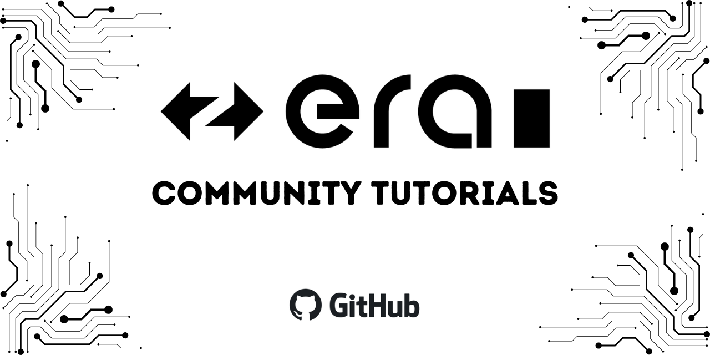

# Community tutorials
<div align="center">



</div>

This repository contains different tutorials submitted by community members. Tutorials will be referenced in the [zkSync Era documentation website](https://era.zksync.io/docs/).

We encourage authors to keep their tutorials updated. 

### zkSync Tutorials 

For tutorials created and maintained by the zkSync team, [check out this repository here](https://github.com/matter-labs/tutorials).

## Tutorial requirements

- All tutorials must showcase how to develop applications on zkSync Era.
- Tutorials must take a neutral stance and refrain from promoting projects.
- Tutorials must be an original and NOT a work that was previously published.
- You must be the rightful intellectual property owner (author) of your submission.
- Tutorials can contain relevant external sources, only when referenced accordingly.
- Tutorials must have working code to support the tutorial.
- Tutorials must be provided following the [guidelines in this repository](#tutorial-guidelines).

## Tutorial guidelines

- Create a new folder inside `tutorials` with the name of your tutorial in *kebab-case*, e.g. `my-awesome-tutorial`.
- In this folder, create a `TUTORIAL.md`. The tutorial must follow this structure:
  - Title (Level 1 heading)
  - Introduction (Level 3 heading): explain what is going to be built in this tutorial.
  - Prerequisites (Level 2 heading): system and technical requirements. **Indicate the specific versions of packages and compilers used to build the project.**
  - Build time! (Level 2 heading): step-by-step details on how to build the project.
    - Step 1 — Doing the First Thing (Level 3 heading)
    - Step 2 — Doing the Next Thing (Level 3 heading)
    - Step n — Doing the Last Thing (Level 3 heading)
  - Conclusion (Level 2 heading): summarize what the reader has accomplished by following your tutorial.
- Create a `code` folder with any code to support the tutorial.
- Create an `images` folder with any images to support the tutorial.
  - If your tutorial contains images, make sure to compress them using https://squoosh.app/ before adding them to the `images` folder.
- Add the tutorial details to the `tutorials.json` file. Each tutorial must have:

```json
{
    "title": "", // 60 characters max
    "description": "", // 280 characters max
    "tags": [ // 4 tags max. Examples: oracles, devtools, nfts, tokens, indexers,
      "",
      ""
    ],
    "level": "", // beginner, intermediate or expert
    "author": "", // person, project, or company
    "slug": "" // the tutorial folder name inside `/tutorials`
  }
```
  
Use the [TUTORIAL_TEMPLATE](./tutorials/TUTORIAL_TEMPLATE.md) and [zksync-cli-quickstart tutorial](./tutorials/zksync-cli-quickstart/) as a reference.

## How to submit a tutorial

- Clone this repo.
- Create a new branch and [add your tutorial following the guidelines](#tutorial-guidelines).
- Make sure [your tutorial follows the requirements](#tutorial-requirements)
- Create a pull request.

## Linting, Formatting, and Spell Check

Before submitting your tutorial, ensure that your content adheres to the repository's standards by running the following checks:

- Formatting with Prettier: `yarn lint:fmt`
- Spell Check: `yarn lint:spell` - If lint:spell doesn't recognize a word, and you’re sure that it’s correct, consider adding it to cspell-zksync.txt.
- Linting: `yarn lint:mdl`  
